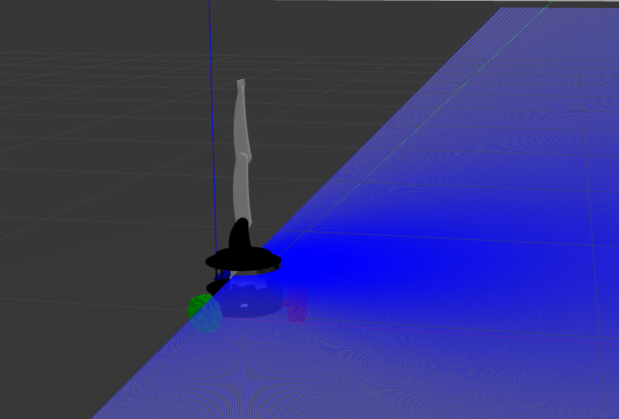
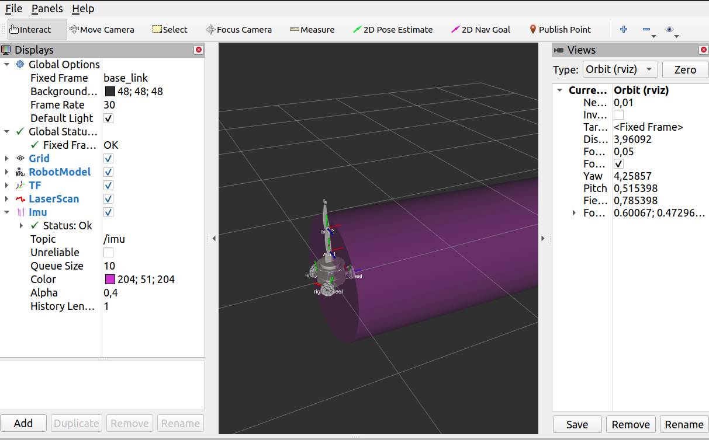
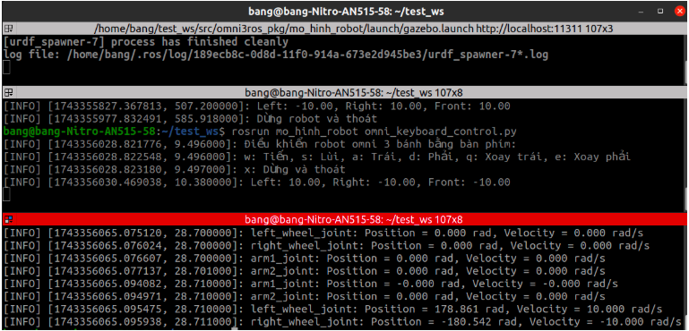
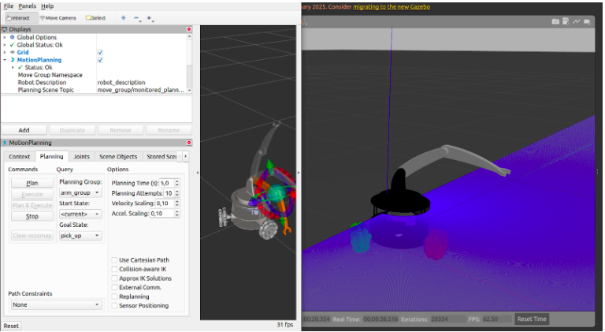

Dưới đây là nội dung tương tự được viết lại cho robot omni 3 bánh của bạn, kèm theo mã Markdown để định dạng tài liệu.

---

### Nội dung cho Robot Omni 3 Bánh

#### **Mô Phỏng Robot Omni 3 Bánh với Gazebo và RViz**

##### **Tổng Quan**
Dự án này mô phỏng một robot omni-directional 3 bánh trong môi trường Gazebo, tích hợp với RViz để trực quan hóa. Robot có thể được điều khiển thông qua bàn phím, bao gồm chuyển động của bánh xe và tay máy (robotic arm). Hệ thống cũng hỗ trợ hiển thị dữ liệu từ encoder của các bánh xe.

##### **Yêu Cầu Cần Thiết**
- ROS Noetic (hoặc phiên bản ROS tương thích)
- Gazebo (phiên bản hỗ trợ ROS)
- RViz

Trước khi chạy, hãy đảm bảo bạn đã source không gian làm việc ROS:
```
cd catkin_ws
catkin_make
source devel/setup.bash
```

##### **Hướng Dẫn Sử Dụng**

1. **Khởi động Gazebo cùng RViz**
   ```
   roslaunch mo_hinh_robot gazebo.launch
   ```

   **Hình Ảnh Mô Phỏng**  
   
   

3. **Cấp quyền thực thi cho các file điều khiển**
   ```
   chmod +x keyboard_arm_control.py
   chmod +x omni_keyboard_control.py
   chmod +x display_encoders.py
   ```

4. **Điều khiển bánh xe thông qua bàn phím**
   ```
   rosrun mo_hinh_robot omni_keyboard_control.py
   ```

5. **Điều khiển tay máy (robotic arm)**
   ```
   rosrun mo_hinh_robot keyboard_arm_control.py
   ```

6. **Hiển thị dữ liệu từ encoder**
   ```
   rosrun mo_hinh_robot display_encoders.py
   ```
   
7. **Motion Planning**
   ```
   roslaunch moveit_robot_arm_sim full_robot_arm_sim.launch 
   ```
   
---

